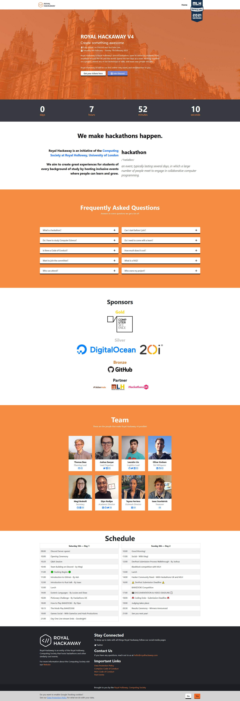

# Royal Hackaway

- [Website](https://royalhackaway.com)
  - [Hackaway v6](https://royalhackaway.com/events/hackawayv6/)
  - [~~Hackaway v5~~](https://royalhackaway.com/events/hackawayv5/)
  - [~~freshers hack~~](https://royalhackaway.com/events/freshers2021/)
  - [~~Hackaway v4~~](https://royalhackaway.com/events/hackawayv4/)

# Information

The Hackaway website is a key resource that provides details of our Hackaway-related events to sponsors and attendees alike.
Having a site that effectively communicates this information is critical to a successful event.
As of 2021-22, the Royal Hackaway site is built with GatsbyJS, and is hosted on GitHub pages,
but built by GitHub Actions. Additionally, the website is built by CloudFlare pages, to preview development branches.
In terms of structure, everything has been built roughly in line with the default Gatsby project,
along with standard ReactJS folder structure, such as components in the /src/components folder.

Some key details:

- The homepage is decided by the homepage frontmatter flag. Only one event can have this flag at a time.
- When linking to Royal Hackaway, always use the long form link if you intend for that link to last forever.
  - https://royalhackaway.com/ won’t point to v4 forever!
  - https://royalhackaway.com/events/hackawayv4 does!
  - (Almost as if the folder structure means something)
- Settings are in gatsby-config.js
- Check out the latest event in /src/posts/events for an idea of how to create a new event page.
- Don’t worry about transpiling SASS/SCSS; This is done for you by Gatsby.

Remember to collaborate. People want to help you out, so let them. Code is code. Don’t be protective.
Some examples of what not to do:

- Privatise the GitHub repository
- Transpiling the SASS/SCSS to plain CSS
- Obfuscate your CSS so nobody else can read it
- Add a mysterious script that loads content from your personal server, and refuse to tell people what it does.
  - Keep imports to NPM only.

(the last two actually happened to Alex)

It may be tempting to rebuild the site into something more technically impressive, with an expanded scope.
Indeed, at some point, someone will probably end up building the site from scratch again.

# Images

# Contributing

- Please check Notion, open issues and PRs before working on anything or opening a new one!
- Please ensure you have run `yarn format` before pushing new code.
